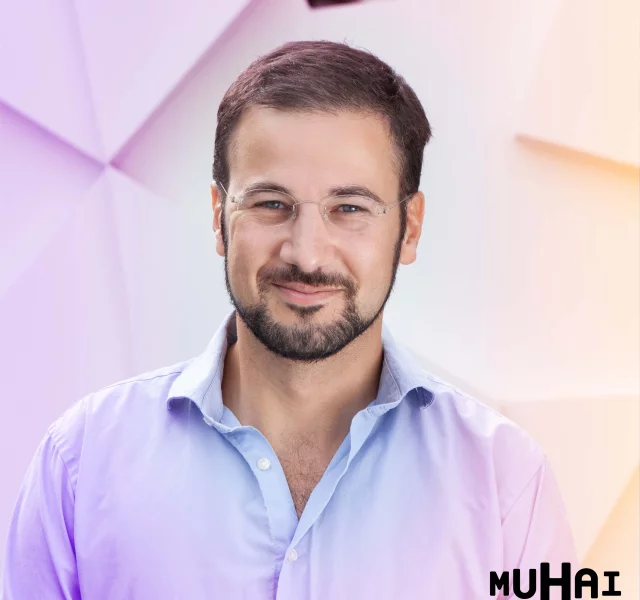

# MUHAI tutorial
26-11-2024 EKAW2024

## Tutorial Content

[MUHAI](https://muhai.org/) is an EU project that studies how to build AI systems that are able to give meaning and understanding to everyday life in a human-centric way. The main idea is to go beyond _cognition_ based on statistical AI methods to recognise data-driven patterns, and integrate _sapience_ in the form of symbolic AI methods, including structured knowledge representations, reasoning and constructivist learning. More info on our main research hypotheses below. 

In this tutorial, participants will learn how to build human-centric AI agents using the MUHAI approach, through a mix of showcases related to understanding everyday activities in the real world and hands-on exercises to practise with the solutions developed within the project. We focus on the hybrid integration of symbolic AI (including e.g. ontological modelling of narratives, automated knowledge extraction from large-scale knowledge graphs, storage of episodic and semantic memories) and subsymbolic AI methods (language understanding, speech processing, reinforced learning, active learning, etc.).

## Tentative Program

09:00-10:00 : Introduction to MUHAI. Participants get to know the MUHAI project, hypotheses and proposed solutions (frontal session). 

10:00-10:30 : Demo market. Quick round of demo showcase (frontal presentations).

11:00-12:30 : Interactive hands-on session (walk around). 

12:30-13:00 : Conclusive remarks, collection of feedback, future steps (panel/discussion). 

## Can I participate?

Of course! The tutorial aims for a broad audience in terms of topics. We are looking for participants that are interested in neuro-symbolic integration, speech and natural language processing, knowledge modelling and construction, narratives and event-centric knowledge graphs, but also VR, robotics, social scientists and cooking enthusiasts are welcome. 

Also, we have _toetjes_ for our participants!

## Organisers

 **Ilaria Tiddi** is an Assistant Professor in Hybrid Intelligence at the Knowledge in AI (KAI) group of the Vrije Universiteit Amsterdam (NL). Her research focuses on creating systems that generate complex narratives through a combination of semantic technologies, open data and machine learning, applied mostly in scientific and robotics scenarios.

 **Rachel Ringe** is a PhD student at the Digital Media Lab at the University of Bremen. Her research interests are in Human-AI-Interaction and Human-Robot-Interaction with a focus on the topic of trust. Since 2022 she has been working in the MUHAI (Meaning and Understanding in Human-centric AI) project. She has supervised a student project on XR technologies in everyday life and been tutoring classes on programming, algorithms and datastructures as well as entertainment computing.

 **Carlo Santagiustina** is an Assistant Professor in Behavioural Economy at SciencePo in Paris with a special love for tweetoric and computer science. In Muhai, Carlo contributed to the design and development of a web observatory for understanding people's views and narratives about social inequality, using social media data and semantic web sources, such as Wikipedia.

 **Remi van Trijp** obtained his PhD from the University of Antwerp (Belgium) in 2008 and is currently heading the Language Research unit at the Sony Computer Science Laboratory Paris. He is one of the chief developers of Fluid Construction Grammar, a formalism of Construction Grammar that aims to shed new light on language acquisition, processing and evolution by developing experiments that combine techniques from computational linguistics, artificial intelligence and robotics. 
  

## MUHAI Hypotheses in a Nutshell

The MUHAI approach relies on 3 hypotheses:
- **Modularity Hypothesis**: The process of understanding consists in constructing a coherent narrative about a situation that integrates and is compatible with a multitude of modular knowledge sources. These knowledge sources range from visual and motor experiences rendered through quantitative and qualitative simulation, to language processing, to semantic and episodic memory stored and accessed via knowledge graphs.
- **Multiplicity Hypothesis**: The neural, machine learning approach to AI, as explored in behaviour-based cognitive robotics or generative AI, appears to be an effective operational model for the (system 1, data-driven, fast) cognitive mind whereas the knowledge-driven methods used in expert decision systems or semantic web applications is a more effective model for the (system 2, knowledge-driven, deliberative, slow) sapient mind. Human-centeredness when dealing with everyday activities can be reached using a hybrid approach that tightly integrates cognition, and sapience together with embodiment (perception), consciousness and sentience. 
- **Constructivist Learning Hypothesis**: knowledge in the form of categories and theories are not derived from data by generalisation but only exists within the human mind. Learners then constantly try to develop their own individual mental model of the real world from their perceptions of that world. Learners continually update their own mental models based on new incoming information (active learning), on social interaction (multi-agent learning) and on the goal of their tasks (goal-directed learning). 
